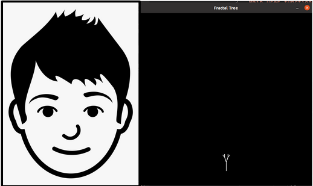
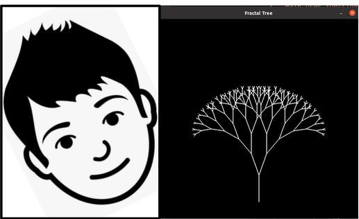

# interactive-webcam-art
[Project Website](https://literate-fiesta-b84aab6c.pages.github.io/)  
[Download Code](https://github.com/olincollege/interactive-webcam-art/archive/refs/heads/main.zip)

This project uses body tracking through the computer webcam to generate art that is controlled through body movement.   

A few libraries are needed to run this code:

Install [Mediapipe](https://google.github.io/mediapipe/) using: `pip install mediapipe`

Install [OpenCV](https://pypi.org/project/opencv-python/) using: `pip install opencv-python`

Install [pygame](https://www.pygame.org/wiki/GettingStarted) using: `pip install pygame`  

Running main.py will generate the tree using data from the webcam. Currently the code is set up so that the number of brances on the tree is determined by the position of a nose on the x-axis. There can be 0-9 branches based on that position. 

artwork.py is the code for the Art class which is used to generate the tree in main.py. artwork.py uses pygame to make the fractal tree.
bodytracking.py is the code that uses opencv and mediapipe to estimate body position with the webcam. converter.py takes the information from bodytracking.py and formats it in a way which is more useable when interacting with the Art class.

https://user-images.githubusercontent.com/91572237/167382246-bd9cbc3d-e74a-48d6-a58b-6cabedd63d7f.mov  

In this clip, I am projecting the tree onto the wall behind me as I move in front of the webcam. 

This project is rather simple right now, but it can very easily be expanded upon and further developed. I would like to use body position to generate rgb values for the tree. I would also like to use body position to change the angles between the branches.  

My name is Ellie Ramos and I am a student at Olin College of Engineering. I love creating art and I think that this project was a great introduction to the intersection of art and technology. I am excited to continue this project and similar projects in the future. 
